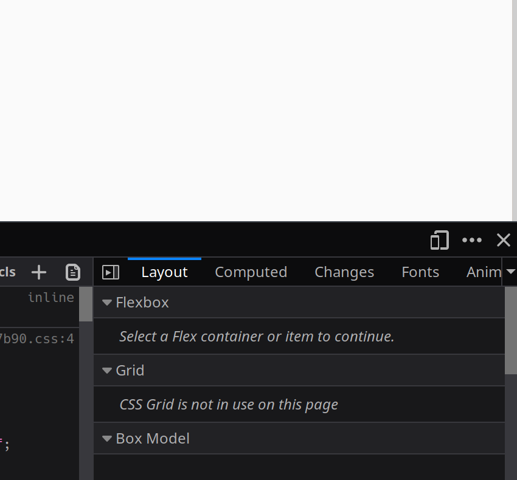

# Soziale Medien

### Facebook

**Einfacher Beitrag**:

Ein einfacher Beitrag besteht aus einem Foto oder einem Link + Text. Wie das [Wolkenschaf](https://www.facebook.com/HeuschreckeBio/photos/a.250934202071839/690901571408431/?type=3&theater).

1. Gehe zu [https://www.facebook.com/HeuschreckeBio/](https://www.facebook.com/HeuschreckeBio/)

2. Fuer einene einfachen Beitrag (1 Link oder 1 Foto + Text), klicke in der Mitte es Bildschirms auf Verfasse einen Beitrag. 

3. Text eingeben, oder Link einfuegen, oder beides. Der Link wird meistens automatisch geladen und es wird eine kleine Voransicht gezeigt. Fotos kann man per Drag'n'Drop hinzufuegen. D.h. man zieht das Foto mit der Maus einfach in das Feld. Dann wird es dort hochgeladen.

4. Wenn man fertig ist, klickt man unten auf den blauen Knopf druecken, auf dem steht: `Jetzt teilen`.

5. Das war's.

**Notiz:**

Notizen sind fuer mehrere Bilder, ein bisschen wie ein Blogbeitrag. Meistens sind sie einfach, aber wenn ich versuche, viele Bilder hochzuladen, macht es manchmal Probleme. Da ist es besser, einfach einen Heuschrecke Blog Beitrag zu erstellen und diesen dann zu teilen. Hier ist trotzdem die Anleitung zum probieren.

1. Gehe zu [https://www.facebook.com/HeuschreckeBio/](https://www.facebook.com/HeuschreckeBio/)

2. In der linken Seitenleiste, klicke auf `Notizen` 

3. Im naechsten Menue auf `Notiz hinzufuegen` klicken.

4. Es oeffnet sich ein Fenster, das ein bisschen so funktioniert, wie der Heuschrecke Blog Editor. Oben kann man ein Bild als Titelbild hochladen, dann kann man einen Titel hinzufuegen und darunter hast du ein Textfeld `Schreib etwas...` in dem du verschiedene Formen von Informationen hinzufuegen kannst: Text, Ueberschriften, Bilder, Videos, ...
Zur Bestimmung kannst du wenn du in das Feld klickst, direkt links daneben auswaehlen, was es sein soll.

5. Falls es irgendwann nicht mehr funktioniert, unten rechts auf `speichern` klicken. Dann in das leicht dunkle Feld neben dem Eingabe-Feld klicken, um die Notiz zu schliessen. Oben auf `Meine Entwuerfe` klicken, dann in dem Feld darunter auf die gerade gespeicherte Notiz. Es erscheint ein neues Feld in dem man unten auf `bearbeiten` klicken kann. Dann solltest du wieder im gewohnten Editor sein und dieser sollte auch wieder funktionieren.

### Instagram 

Instagram ist ein bisschen komplizierter, weil es eigentlich alles auf dem Handy ablaufen soll. Mit einem kleinen Trick, geht es aber auch auf dem PC.

1. Bei Instagram einloggen.
2. Je nach dem welchen Browser ihr benutzt, unterscheidet sich der naechste Schritt etwas. Ich empfehle Firefox, aber erklaere auch Chrome. Andere Browser werden aehnlich funktionieren, aber ich werde nicht alle einzeln erklaeren.

    - Firefox: 
        1. Druecke gleichzeitig `Strg + Shift + i`. Es sollten sich unten die Web-Entwickler-Tools oeffnen. 
        2. Auf der rechten Seite auf die zwei Rechtecke klicken oder gleichzeitig `Strg + Shift + m` druecken. 
        3. Das Fenster sollte jetzt klein werden. Oben im Fenster erscheint eine kleine Optionsleiste, auf der `Responsiv` steht. Darauf klicken und Iphone 6/7/8 auswaehlen. Der Bildschirm nimmt jetzt die Groesse des gewaehlten Geraetes an.
        4. Die Seite neu laden mit einem Druck auf `F5` auf der Tastatur.

    - Chrome: 
        1. Druecke gleichzeitig `Strg + Shift + i`. Es sollten sich rechts die Web-Entwickler-Tools oeffnen.
        2. In diesen Tools oben Links auf die 2 Rechtecke klicken oder gleichzeitig `Strg + Shift + m` druecken.
        3. Das Fenster links sollten jetzt kleiner werden. Oben im Fenster erscheint eine kleine Optionsleiste, auf der `Responsiv` steht. Darauf klicken und Iphone 6/7/8 auswaehlen. Der Bildschirm nimmt jetzt die Groesse des gewaehlten Geraetes an.
        4. Die Seite neu laden mit einem Druck auf `F5` auf der Tastatur.

5. Das angezeigte Fenster sollte sich veraendern. Unten sollte jetzt eine Leiste erscheinen, in deren Mitte ein grosses Plus zu sehen ist. 
        
6. Auf besagtes Plus druecken. Es oeffnet sich ein Menue in dem man ein Bild auf seinem PC auswaehlen kann. Das bitte tun.
       
7. Hat man eins gefunden und geoeffnet, erscheint es im Browser als Voransicht. Hier kann man es etwas bearbeiten. Oft reicht ein Klick auf die 2 Pfeile, um das Bild herauszuzoomen. Weiter geht's oben rechts auf `Next`   
       
8. Hier kann man jetzt den Text eingeben, Links gehen nicht. Mit einem Klick oben rechts auf `Share`, wird der Post veroeffentlicht. Das wars.  

So viel zur grundlegenden Social Media Anleitung. Bei Fragen oder Rueckmeldungen, gerne bei mir melden.
    